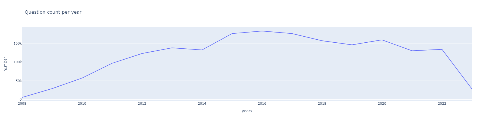
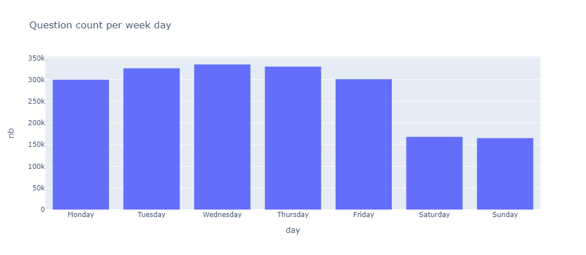
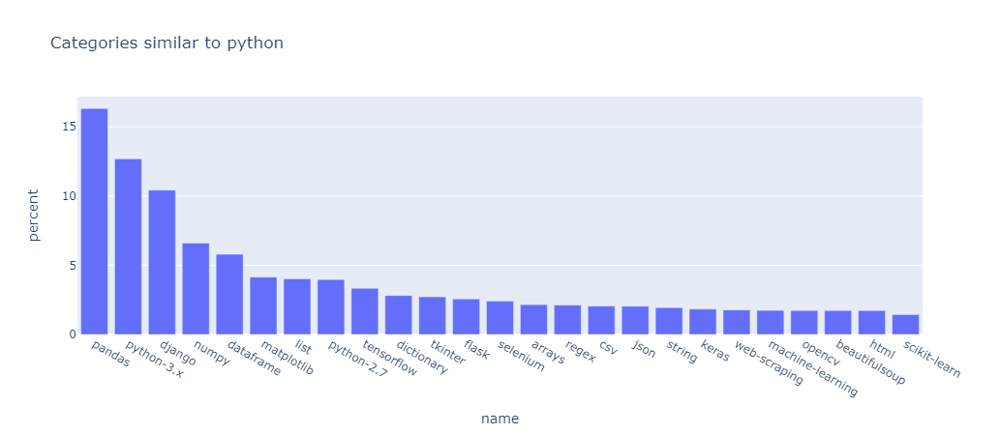

# StackOverflow Analysis

## Abstract

StackOverflow is one of the most used forum in IT and computer programming. Since its creation in 2008, the network has grown to boast over 3.5 millions registered users, who have posted over 20 million questions. Each question is made of a short title followed by the problem's full description, and is linked to a few categegories which should help users to get relevants answers. I wanted to explore this huge question database, to try to get some insights.

## Data acquisition

Unfortunatly, there is no public API or database. Webscrapping seems to be the most straightforward way to create a consequent database. I decided to use Python with the BeautifulSoup library to extract questions' headers, and to load them in a Postgresql database.
The SQL schema is created opn the fly by the Python script, and use the following table structure :

|Table name|Usage|Number of row|
|----------|-----|-------------|
|question|The main question table, containing title + UID + description|1.9m|
|category|Category list with unique entity to avoid data dupplication, and help in category segmentation|50k|
|question_category|Many to many relation table between question and category|5.7m|

All the infrastructure runs with a docker-compose file, in order improve reproductibility. After a few hours scraping, we came out with a almost 2m questions database, which represents almost 10% of the total database.
Here is the questions' number per year in the database : 

## Dataviz

From the scraped database, we can now draw a few charts to better understand our data.

Wer can see that the question number for 2023 is pretty low, this is due to the project being done in march 2023, wich represents 25% of the whole years.

We can also try to understand when are questions asked on the forum.

We can see that most of questions are asked during office days, as week-end days leads to almost half of a worked day question count.
We will see wich categories are most impacted by weekday [here]().

Here, we try to  plot wich categories are the most related to a selected one. This is an exemple for Python. The output shows the most commonly used python library, such as pandas and numpy.

We used the same process for a few technologies, and charts can be found [there](./dataviz/similar/similar_category.ipynb)