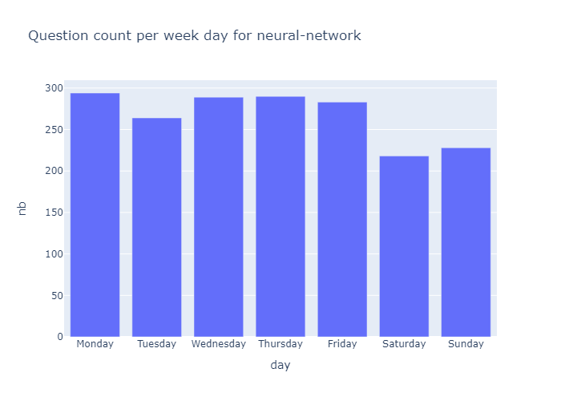

# Weekday analysis

From theses results, we can measure the relative difference between the amount of question asked in office days and weekend days. Theses scores can be then ploted to show among the most popular technologies, which ones are also used by developpers on their free time, as a hobby. 

Microsoft's performance of owning 70% of the top-10 most less used by people when they have a choice shoul be awared.